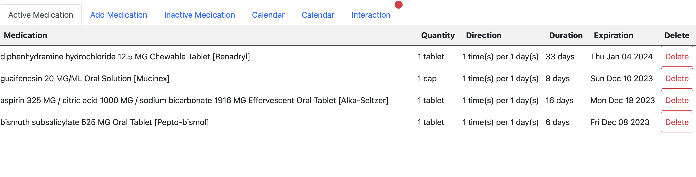
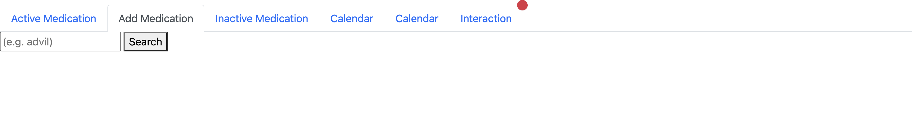
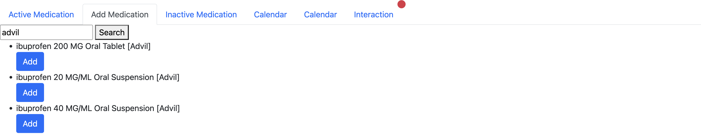
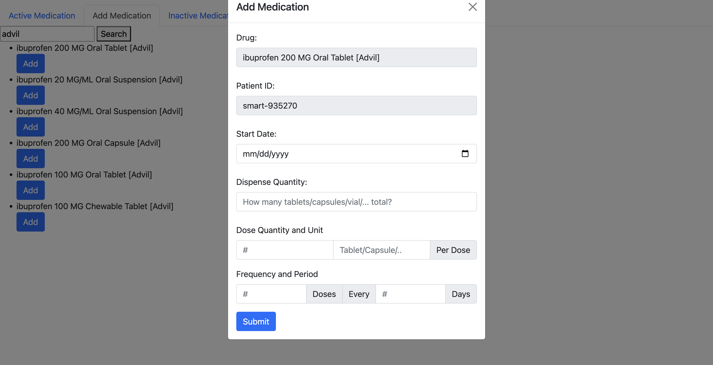
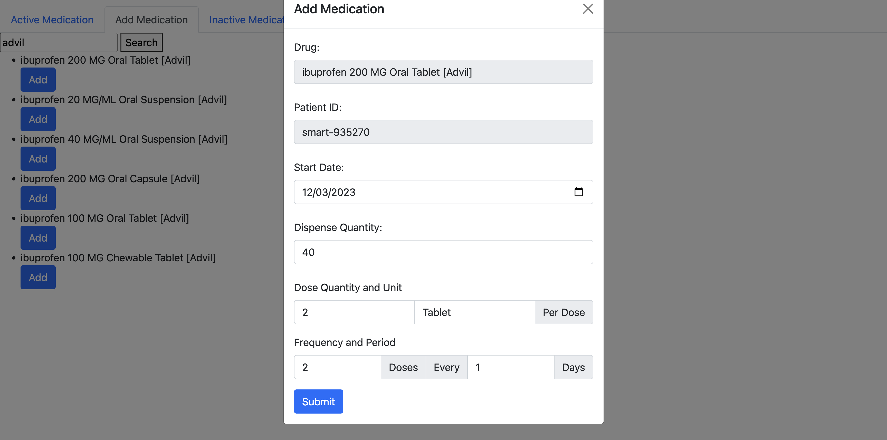
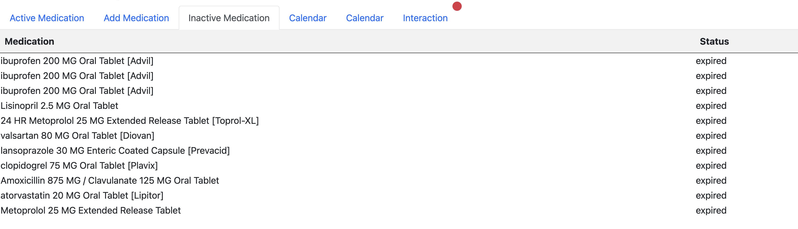
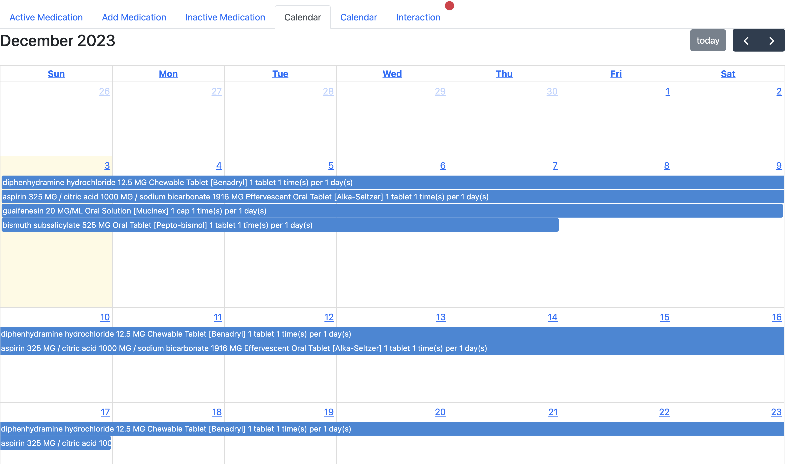
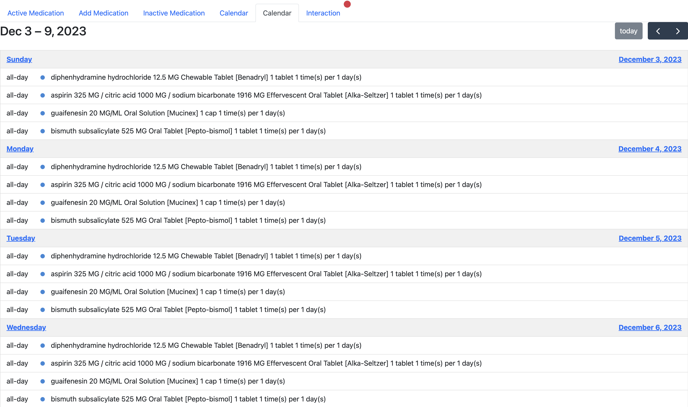
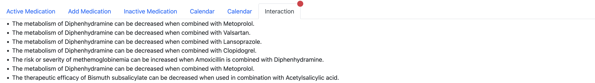

# Overview

The app's features are separated by tabs.

## Active Medication

This feature shows any medication the patient is currently prescribed.
Information displayed include Medication Name, Quantity, Direction, Duration, Expiration Date, and Delete.

The <Delete> button would delete the medication from the patient record entirely.

## Add Medication

This feature allows a patient to search for the name of a medication and add it to their health record.

The Add form includes information that would help the patient keep track of what medication they are currently taking together with instructions and end date.

After adding, the result will show up in Active medication tab and Calendar tabs.

NOTE: Sometimes the server is loading slowly, it would take several refresh for the newly added medication to show up in patient's health record.

## Inactive Medication

All medication that are set as inactive (not deleted) due to expiration or other reasons will show here for a history view of medication taken.

## Calendar

### Month view

The patient can have an overall view of their current medication on this calendar together with instructions and end dates.

### Day view

Similarly, this calendar shows day view

## Interaction

This tab shows any potential interaction between 2 drugs the patient is taking.

